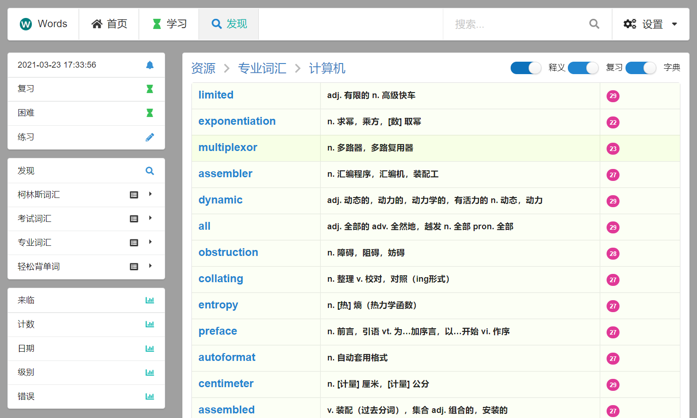

# words

## A django application for dictation and review English words for Chinese

## 安装方法

### Docker

拉取镜像：

    docker pull stevenkang/words

执行程序，用于存储数据库的目录可自行修改，以下的 `./local`：

    mkdir -p ./local && docker run -d --rm -v ./local:/app/local -p8888:8888 --name words stevenkang/words

然后访问浏览器：<http://localhost:8888/>

### Legacy

<https://github.com/StevenBaby/words/blob/master/doc/usage/installation.md>

## 使用方法

<https://github.com/StevenBaby/words/blob/master/doc/usage/usage.md>

## 故障排除

<https://github.com/StevenBaby/words/blob/master/doc/usage/troubleshoot.md>